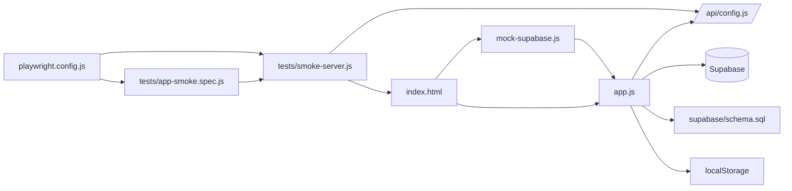

# Piano Chord Library Architecture

## Purpose

This document explains how the app is built, how the files depend on each other, and what each piece does.
It is written for someone who wants to understand the app without already knowing programming.

## System layout

The app has four main layers:

1. **Page layer**  
   `index.html` defines the page structure.

2. **Presentation layer**  
   `styles.css` defines the visual design.

3. **Application logic**  
   `app.js` contains the actual behavior of the app.

4. **Storage and backend layer**  
   Supabase stores the user data, while `api/config.js` provides the environment values needed to connect.

There is also a **testing layer**:

- `tests/smoke-server.js` serves the app locally for browser tests
- `tests/app-smoke.spec.js` verifies the main flows still work
- `playwright.config.js` configures those tests

## File-by-file guide

### `index.html`

This is the page skeleton.
It defines:

- the loading screen
- the sign-in and sign-up screen
- the main library shell
- song editing and preview panels
- setlist editing and preview panels
- help, account, performance mode, and undo delete overlays

It also loads the two scripts that start the app:

- `mock-supabase.js`
- `app.js`

### `styles.css`

This file controls the visual design.
It defines:

- background colors and gradients
- card layouts and spacing
- button styles
- tabs, lists, forms, and badges
- the chord tooltip and performance mode layout
- responsive behavior for the page

In short, this is what makes the app feel like a polished interface instead of plain HTML.

### `app.js`

This is the heart of the application.
It is responsible for:

- starting the app
- connecting to Supabase or mock data
- authentication
- profile loading and saving
- song loading, editing, autosave, delete, and undo delete
- setlist creation and editing
- URL import
- transposition logic
- preview rendering
- performance mode
- auto-scroll behavior
- chord tooltip voicing previews
- local browser storage for a few preferences

It is the largest file because it holds both the data model and the behavior that ties the whole app together.

### `api/config.js`

This is a tiny serverless function.
Its job is simple:

- read `SUPABASE_URL` and `SUPABASE_ANON_KEY` from environment variables
- return them as JSON
- fail clearly if either value is missing

The browser uses this endpoint so it can discover the Supabase settings when running on Vercel.

### `mock-supabase.js`

This file creates a fake Supabase-like object in memory.
It is used for mock mode and local demo flows.

What it does:

- simulates login and sign-out
- stores mock profiles, songs, setlists, and setlist items
- supports query-like calls such as `select`, `insert`, `update`, `delete`, and `upsert`
- emits auth state changes so the app behaves like it is talking to a real backend

This makes it possible to test the app without connecting to a live Supabase project.

### `supabase/schema.sql`

This file defines the real database structure.
It creates:

- `profiles`
- `songs`
- `setlists`
- `setlist_items`

It also defines:

- indexes for common lookups
- triggers that update `updated_at`
- row-level security rules so each user only sees their own data

This is the source of truth for how the production data should look.

### `playwright.config.js`

This configures browser tests.
It tells Playwright:

- where the tests live
- what the local base URL is
- how long tests may run
- how to start the local test server

### `tests/smoke-server.js`

This is a small local server used only for tests.
It:

- serves static files like `index.html`, `styles.css`, and `app.js`
- exposes `/api/config` by reusing the real config handler
- allows the browser tests to run against a realistic local setup

### `tests/app-smoke.spec.js`

This file contains the smoke tests.
It checks that:

- the app boots through the real `/api/config` path
- mock mode opens correctly
- the setlist flows behave as expected
- performance mode and navigation work
- search, sort, and expand/collapse behaviors stay in sync

### `README.md`

This is the quick start guide.
It explains:

- the stack
- feature summary
- Supabase setup
- Vercel setup
- local development
- smoke testing

One small quirk: it mentions `.env.example`, but that file is not present in this workspace snapshot.

### `package.json`

This file defines the project scripts and dependencies.

Important scripts:

- `npm run dev` starts the app using `vercel dev`
- `npm run test` runs the Playwright suite
- `npm run test:smoke` runs only the smoke test file

### `package-lock.json`

This file records the exact dependency versions that were installed.
It helps keep the test and development environment reproducible so the app and browser tests use the same package versions each time.

## How the files depend on each other

## Runtime flow

### 1. Boot

- The browser loads `index.html`
- The page loads `mock-supabase.js`
- The page loads `app.js`
- `app.js` runs `initialize()`

### 2. Configuration

- If mock mode is active, the app uses `window.createMockSupabase()`
- Otherwise, the app fetches `/api/config`
- `api/config.js` returns the Supabase URL and anon key
- `app.js` creates the real Supabase client

### 3. Session check

- The app asks Supabase whether a session already exists
- If no session exists, the login screen is shown
- If a session exists, the app loads the profile, songs, and setlists

### 4. Library loading

- Songs are mapped into browser state
- Setlists and setlist items are combined into a nested structure
- The UI is rendered from that state

### 5. User interaction

- Editing a song updates browser state immediately
- Autosave writes to Supabase after a short delay
- Saving a setlist writes the new data to Supabase
- Transposing updates the saved transposition and the visible preview
- Hovering a chord shows a tooltip with voicings and piano keys

## Data model in plain English

The app stores four main kinds of information:

- **Profiles**: who the user is and how they like to sort songs
- **Songs**: the title, artist, key, lyrics, chords, and view history
- **Setlists**: named collections of songs
- **Setlist items**: the ordered songs inside a setlist

The relationship is:

- one profile belongs to one user
- one user can have many songs
- one user can have many setlists
- each setlist can have many setlist items
- each setlist item points to one song

## Feature dependency map

| Feature | Depends on |
| --- | --- |
| Login and account creation | `app.js`, Supabase Auth, `index.html` auth form |
| Song editing | `app.js`, `index.html` form fields, `supabase/schema.sql` |
| Song storage | `app.js`, Supabase `songs` table |
| Autosave | `app.js`, timers, Supabase |
| Delete and undo | `app.js`, browser `localStorage`, Supabase |
| Setlists | `app.js`, Supabase `setlists` and `setlist_items` tables |
| Import from URL | `app.js`, browser `fetch`, HTML parsing |
| Preview rendering | `app.js`, `index.html` preview containers |
| Tooltip voicings | `app.js`, browser `localStorage`, preview markup |
| Performance mode | `app.js`, `index.html` overlay, preview rendering |
| Testing | `playwright.config.js`, `tests/smoke-server.js`, `tests/app-smoke.spec.js` |

## What each major part is doing

### UI elements

`index.html` provides the elements that `app.js` looks up with `querySelector`.
For example:

- song list containers
- form inputs
- preview panels
- buttons and tabs
- modal screens

Without those IDs and classes, `app.js` would have nothing to attach to.

### State

`app.js` keeps the current app state in one object.
That state includes:

- signed-in user
- profile
- songs
- setlists
- selected song and setlist
- active tab and workspace
- autosave state
- tooltip state
- performance mode state

This state is the app’s memory while the page is open.

### Rendering

`app.js` uses a render-and-refresh approach:

- update state
- rerender the parts of the page that changed

This is how the same page can switch between songs, setlists, preview mode, and performance mode without reloading the browser.

## Beginner summary

If you want the simplest mental model:

- `index.html` is the structure
- `styles.css` is the appearance
- `app.js` is the brain
- Supabase is the online data storage
- `mock-supabase.js` is the practice version
- `tests/` makes sure the whole thing still works
