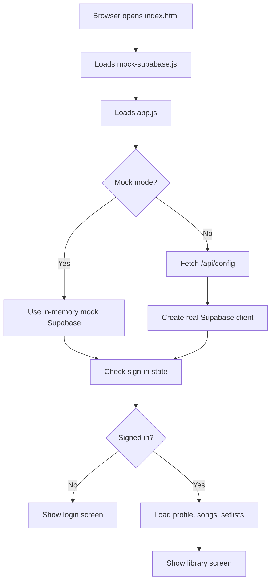

# Piano Chord Library Overview

This project is a web app for storing and previewing piano chord sheets.
Think of it like a private notebook for songs:

- you sign in with an email and password
- you save songs with chords and lyrics
- you organize songs into setlists
- you transpose songs up or down by semitone
- you preview chord charts in a clean reading view
- you can open a performance mode for live use

The app is built from a small set of files:

- `index.html` creates the page and the buttons, forms, and panels you see
- `styles.css` controls how everything looks
- `app.js` is the main behavior of the app
- `mock-supabase.js` is a local fake version of the backend for demo/testing
- `api/config.js` provides the Supabase settings when the app runs on Vercel
- `supabase/schema.sql` defines the database tables and access rules
- `tests/` contains smoke tests that check the app still opens and works

## How the app opens

When the page loads, the browser reads `index.html`. That file loads two scripts:

1. `mock-supabase.js`
2. `app.js`

Then `app.js` starts the app:

- it fills in some dropdowns and event handlers
- it decides whether to use mock mode or real Supabase
- it fetches configuration from `/api/config` unless mock mode is requested
- it connects to Supabase and checks whether the user is signed in
- it loads the user profile, songs, and setlists
- it shows the login screen or the library screen

## What a user can do

### Songs

- create a new song
- edit the title, artist, key, and sheet text
- save automatically while typing
- manually save, delete, or undo a delete
- search and sort songs
- import a song from a supported web page
- transpose the song higher or lower
- hover chords to see voicings and piano keys

### Setlists

- create setlists
- add songs to a setlist
- reorder songs inside a setlist
- remove songs from a setlist
- browse a setlist like a playlist

### Performance mode

- open a larger live-view version of the song
- auto-scroll the sheet while performing
- move through songs in a setlist without leaving the performance view

## Where the data lives

There are two kinds of storage:

- **Remote storage in Supabase** for signed-in user data like profiles, songs, setlists, and setlist items
- **Local browser storage** for small personal preferences, like undo-delete state and preferred chord voicings

That means your songs are stored online and are private to your account, while some tiny UI preferences stay in your browser.

## Big-picture flow

## One-sentence summary

This app is a private, hosted song library for piano chord charts, with setlists, transposition, and performance tools built into a single page.

